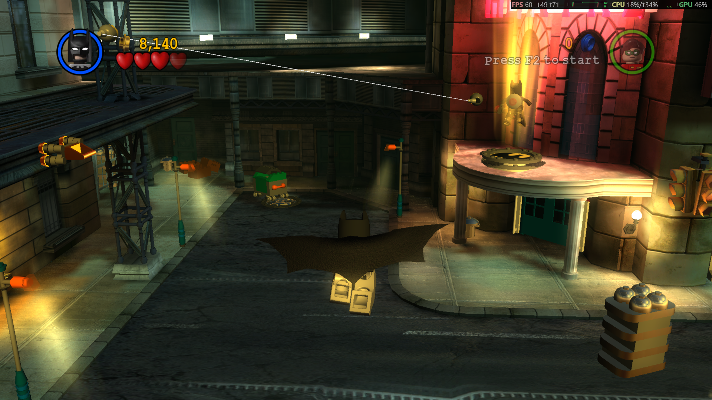
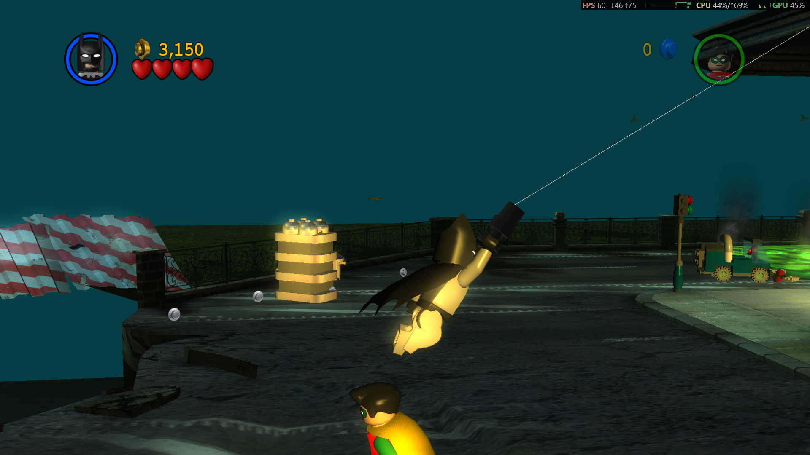

# LegoArkham1
A mod for the steam release of LEGO Batman 1 that aims to closely imitate the Arkham Series gameplay while respecting the original mechanics.




## Features
- Third-person camera
- Mouse look and Arkham-style keyboard controls
- Mouse look for batarang reticle
- Quick grapple: Press F to fire from any spot near the grapple point
- Glide: Hold jump to glide with Batman, Batgirl or Robin in their default suit
- Glide Suit repurposed to enable flight
- Updated vehicle handling for the Batmobile, Batboat and Batwing to work with the new camera mode
- Save Game option in the pause menu, using the game's own auto save mechanic
- Toggle Player 2 with F2
- Updated Control Config menu and defaults
- And much more

## Fixes
- Borderless Window Mode
- Alt+F4 now works to close the game

## Install
Download the release, then copy `dinput8.dll`, `LegoArkham.ini` and the `CHARS` folder next to `LEGOBatman.exe`. 
Settings can be configured in `LegoArkham.ini`.

## Building
Needs Visual Studio 2022 and CMake.

```sh
cmake -B build -A Win32
cmake --build build --config Release
```
## Credits
Thanks to [Bario](https://www.youtube.com/@BarioTheWeird) for the Batman, Batgirl, and Robin glide/cape animations. 
